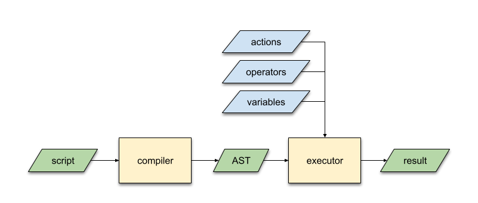

.. _evescript-reference:

EveScript Language Reference
=============================

Basic Syntax
-------------

The basic form of an EveScript is as follows:

::

  # if statement
  if (expression) {
    action1(...)
    action2(...)
  }

  if (expression) {
    ...
  }

  # call action directly
  action3()

An exmaple script may look like this:

::

  if ($currentTime matchCron "0 0 * * *" && $lightSensor > 20 || $lightSensor < 10) {
      say("Only run on midnight 00:00")
      play("music.mp3")
  }

  # another condition
  if ($currentTime matchCron "* * * * *") {
      say("run every minute")
      say(true)
  }

In the above script, ``$currentTime``, ``$lightSensor`` are called **variables**.
They are the data sources of this script. And the ``matchCron``, ``>``, ``||``, ``<`` are **operators**,
where ``matchCron`` is a custom operator, while others are built-in operators. And the ``say``, ``play`` are **actions**.

The `if` statement can be nested too.

::

  # nested if
  if (expr1) {
    if (expr2) {
      action()
    }
  }

You can also use `if...else` statement.

::

  # if else statement
  if (expr1) {
    action1()
  } else if (expr2) {
    action2()
  } else {
    action3()
  }

The following figure shows how a script is compiled and executed.

All variables, actions, and custom operators must be provided when executing this script.
See Actions_, Operators_, and Variables_ for details.

Literals
-----------

EveScript supports the following types for literals:

- Numbers: Only integers (``3``, ``10``, ``-4``) and decimals (``0.6``, ``-2.4``) are supported.
  Scientific notation such as ``3e10`` is **NOT** supported.
- String: A string must be quoted with double quotation marks: ``"Hello, world"``. Single quotation mark is not supported.
- Boolean: ``true`` or ``false``.

Statements
------------

Statements are similar to the *if statements* in other languages.
It uses the C-style: 

- criteria must be placed in parenthesis
- use ``{ }`` around the code block (i.e. actions)

Variables
----------

Variables are part of the expressions in the statement.
When creating a ``EveScriptExecutor``, variables must be provided so that they can be used in the script.

Contrast to the usual concept of "variable" in other languages, variables in EveScript
are *NOT* memory units for storing values. They are more like small functions that act as data sources,
such as reading data from hardware I/O ports, reading the system clock, or fetching data from Internet.

When creating an executor, provide a dict as the ``variables`` field of config, in which
keys are the variable names and the values are the functions that provide data.
The functions must take no parameters, and return a number, a string, or a boolean value.

The following code shows how to create a variable:

::
  
  # Python code
  def lightSensor():
    # read the sensor value from the light sensor
    return read_value_from_light_sensor()

  # the key of the dict is the name of the variable
  variables = {
      '$lightSensor': lightSensor,
  }

  executor = EveScriptExecutor({
      'variables': variables,
      'actions': {},
      'operators': {},
  })

With this definition, the variable ``$lightSensor`` is useable in the script.

::

  # EveScript code
  if ($lightSensor > 10) {
      ...
  }

Operators
----------

EveScript provides some built-in operators in order to construct expressions. 

======== =========================
Operator Description
======== =========================
``||``   logical OR
``&&``   logical AND
``!``    logical NOT
``==``   equal to
``!=``   not equal to
``<``    less than
``<=``   less than or equal to
``>``    greater than
``>=``   greater than or equal to
======== =========================

However, you can also define custom operators to implement your own logical operations.
Similar to variables, custom operators are also small functions or lambdas that take
**two parameters** (i.e. custom operators must be binary operators), and return a **boolean** value.

The following code snippet demonstrates how to create and use a custom operator:

::

  # Python code
  from datetime import datetime
  from croniter import croniter
  
  def matchCron(t, cron):
      """An operator that matches the provided time `t` with the `cron` string."""
      return croniter.match(cron, t)
  
  def currentTime():
      """A variable that returns current system time."""
      return datetime.now()
  
  executor = EveScriptExecutor({
      'variables': { '$currentTime': currentTime },
      'operators': { 'matchCron': matchCron },
      'actions': {},
  })

With this definition, ``$currentTime`` and ``matchCron`` can be used in the code to implement a crontab-like trigger:

::

  # EveScript code
  if ($currentTime matchCron "0 0 * * *") {
      ...
  }

The following table lists the precedence of operators.

============= ==========================
Precedence     Operators
============= ==========================
1             ``!``
2             ``<``, ``<=``, ``>``, ``>=``, ``==``, ``!=``, all custom operators
3             ``&&``
4             ``||``
============= ==========================

Actions
--------

Actions are the functions listedn in the ``{ }`` block. They must be defined and provided when instantiating the ``EveScriptExecutor``.

An action function can take zero or more parameters, and has no return value.

Note there is no semicolon ``;`` at the end of each action.

The following code snippet shows how to define an action:

::

  # Python code
  def lightSensor():
    # read the sensor value from the light sensor
    return read_value_from_light_sensor()

  def say(text):
    """Define an action `say` that prints a message on the console."""
    print(text)

  # the key of the dict is the name of the variable
  variables = {
      '$lightSensor': lightSensor,
  }

  executor = EveScriptExecutor({
      'variables': { '$lightSensor': lightSensor },
      'actions': { 'say': say },
      'operators': {},
  })

With this definition, ``say(text)`` can be called in the scripts:

::

  # EveScript code
  if ($lightSensor > 10) {
      say("It's daytime now!")
  }

EBNF Definition
-----------------

::

  <script> ::= { <statement> }

  <block>  ::= "{" { <statement> } "}"
            |  <statement>
  
  <statement> ::= <if_statement>
               |  <action>

  <if_statement> ::= "if" "(" <expr> ")" <block> [ "else" <block> ]
  
  <expr>   ::= <term> "||" <expr>
            |  <term>
  
  <term>   ::= <factor> "&&" <term>
            |  <factor>
  
  <factor> ::= "(" <expr> ")
            | "!" <factor>
            | <predicate>
  
  <predicate> ::= <operand> <operator> <operand>
              | <boolean>
  
  <operator>  ::= ">"
               |  ">="
               |  "<"
               |  "<="
               |  "=="
               |  "!="
               |  keyword
  
  <operand>   ::= variable
               |  <const>
  
  <const>     ::= string
               |  number
               |  <boolean>

  <boolean>   ::= 'true'
               |  'false'
  
  
  <action>   ::= keyword "(" <params> ")"

  <params>   ::= <param> { "," <param> }
              | empty
  
  <param>    ::= <operand>
